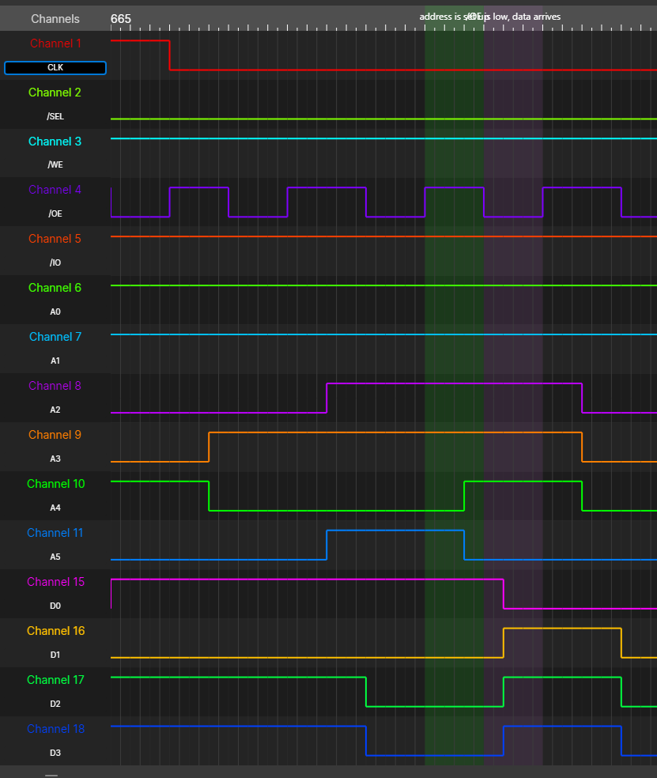
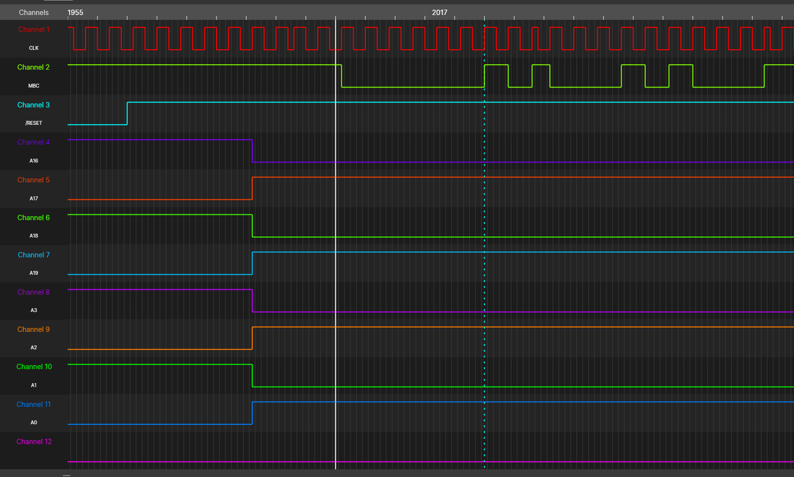

# Retail cartridges

## Construction of WS cartridges

Refer to http://perfectkiosk.net/stsws.html#cart for a pinout of the Wonderswan cartridge bus. Frutratingly WSman has a few pins in its pinout swapped.

Commercially sold Wonderswan games usually contained these components:

* A 16-bit wide ROM chip containing the main game data
* The Bandai chip (either Bandai 2001 or Bandai 2003)

Also optionally either:

* 8-bit wide SRAM for save data, a battery and the GIZA chip
* EEPROM to store save data

Additionally some games contain a real time clock.

Both the ROM and SRAM are connected to the lower 16 address lines and all 16 data lines (ROM), the lower 8 data lines (SRAM), as well as the `/OE` and `/WE` signal.

The Bandai chip is connected to `A0`-`A3`, `A16`-`A19`, `D0`-`D7`, as well as all the control signals. It also serves as a connection serial peripherals like EEPROM or an RTC.

For a schematic of such a cartridge see up-n-atom's [WonderWitch clone](https://github.com/up-n-atom/WonderWitch). Note that the WonderWitch uses a parallel flash memory in place of the ROM chip as it needs to be rewritable.

## Memory access

Both the ROM and the SRAM chip use a standard asynchronous memory interface.

In this trace the CPU access memory repeated. It sets up the address while `/OE` is high (marked in green) and then sets it low, which (marked in pink) is when the Bandai chip will select the right chip, which will then provide the data.

For every memory access the Bandai chip will use the upper address bits (`A16`-`A19`) to select either the ROM or SRAM and provide the upper address bits (beyond the low 16-bits) based on its internal registers which can be set using I/O accesses.

It is presumed that the CPU latches the data to be read on the rising edge of `/OE`.

## I/O

Cartridge I/O registers are handled by the Bandai chip. They are made like regular memory accesses, except that the `/IO` signal is low during the regular `/OE` or `/WE` is. See again http://perfectkiosk.net/stsws.html#cart for more information.

I/O accesses are 8-bit wide (using `D0`-`D7`) with an 8-bit address. Since the Bandai chip is not connected to the full address bus, the upper four address bits are output on `A16`-`A19`.

## Reset signal

After power up a monochrome Wonderswan `/RESET` stays low for about 18 ms.

Pulling it low again with an open drain I/O leads to a current of 1 mA on a monochrome Wonderswan and 4.9 mA on a color Wonderswan.

The reason, this can be important, is, that some FPGAs or microcontrollers need longer to initialise. Pulling the reset signal low again once they are done might be a viable option for them.

## Unlocking

Shortly after `/RESET` goes high again a handshake between the SoC (CPU) and the Bandai chip is performed. If it is not sucessful, the bootrom will refuse to load the game and not even show the Bandai logo.

The opening sequence is synchronous to the serial clock signal. It begins after the the rising edge of the clock when `A0`-`A3` become 0x5 and and `A16`-`A19` become 0xA. On each subsequent rising edge a bit will be output via `MBC`. The sequence is (lowest bit output first) 0b1000101000101000000111. Afterwards `MBC` stays high indefinitely and is not used anymore until the system is reset.

It seems like there is some allowed variance in the number of cycles before the first low MBC value. Though how it is depicted in the trace (where it is output during the fourth rising edge after the rising edge with the address change) is how official Bandai chips seem to behave.

## Speed requirements

Generally speaking the `/OE` or `/WE` signal seem to go low and high again with a frequency of about 3 MHz which is probably derived from the 12.288MHz system clock. This leaves half the period, so about 162 ns to handle one memory access.

## Power consumption

See [current consumption](current_consumption.md) for my experiments regarding this.

## Mechanical details

|Distance|Length (in mm)|
|------|-----------------|
|Distance pad to pad|1.25|
|Left edge to first pad|0.7|
|Last pad to right edge|0.95|
|Bottom edge to longer pads (GND, Vcc)|0.5|
|Bottom edge to shorter pads|1|

TODO: make a proper mechanical drawing