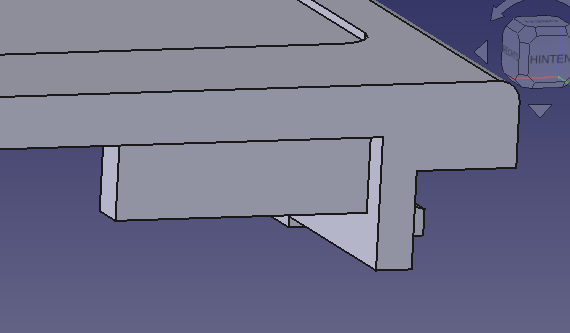

# Shell

**If you previously printed the shell yourself or ordered it somewhere, please note that there was a mistake in the model which sometimes can lead to damage on the PCB. **

This can be easily be fixed by trimming the lid part near the button so that it looks as pictured:

The models have been updated that with the current files the issue does not exist anymore.

The nileswan shell consists of three parts: the bottom part where the PCB is inserted into, the lid which slides on similarly to as is seen on Game Boy cartridges and a cover for the cartridge button. A M2xL2xOD3.2 threaded insert in the lid and an M2x3 flat head screw hold the casing together.

Note that the files here are designed only with FDM printing in mind. They may have bad fitting or may not come out at all with other manufacturing processes.

For FDM printing the lid utilises a custom support piece, which is to be meant to be printed with an incompatible filament so that it can be later be pulled off leaving a clean surface for the label sticker to apply (our shells are printed in PETG with PLA used as support).

The button piece is best printed from PLA, PETG is too "droopy" for the fine details.

The files in this folder are licensed under the terms of [CC BY-SA 4.0](https://creativecommons.org/licenses/by-sa/4.0/).
